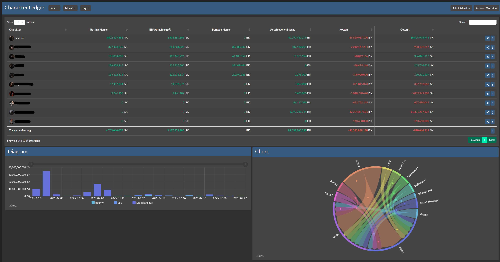
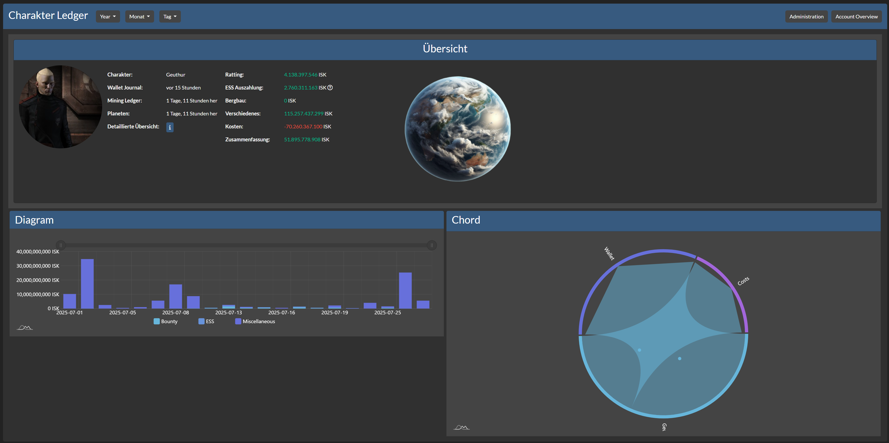
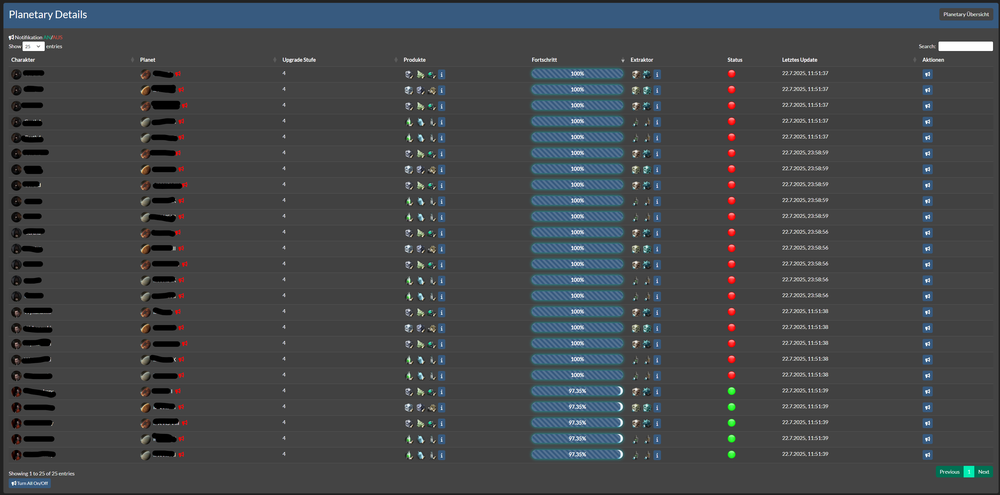
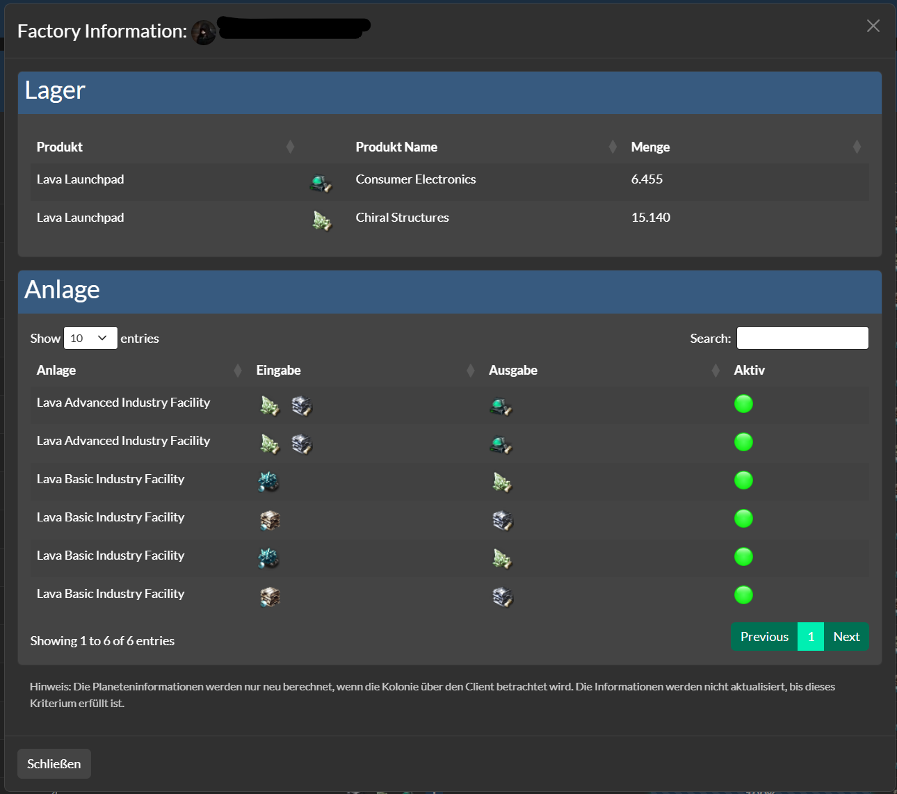
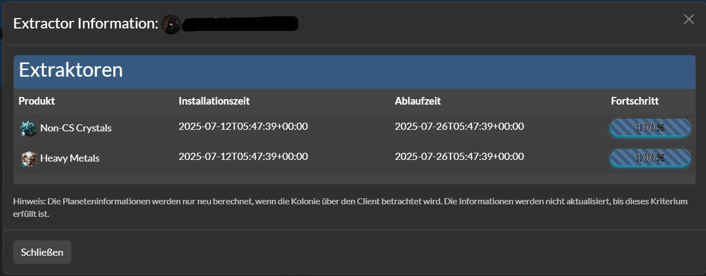

# Ledger module for AllianceAuth.<a name="aa-ledger"></a>

[](https://results.pre-commit.ci/latest/github/Geuthur/aa-ledger/master)
[](https://github.com/psf/black)
[](https://github.com/Geuthur/aa-ledger/actions/workflows/autotester.yml)
[](https://codecov.io/gh/Geuthur/aa-ledger)

[](https://ko-fi.com/W7W810Q5J4)

Character and Corporation statistics, including detailed information on ESS, Ratting, Trading, Mining, and other activities.

______________________________________________________________________

- [AA Ledger](#aa-ledger)
  - [Features](#features)
  - [Upcoming](#upcoming)
  - [Installation](#features)
    - [Step 0 - Check dependencies are installed](#step0)
    - [Step 1 - Install the Package](#step1)
    - [Step 2 - Configure Alliance Auth](#step2)
    - [Step 3 - Add the Scheduled Tasks and Settings](#step3)
    - [Step 4 - Migration to AA](#step4)
    - [Step 5 - Setting up Permissions](#step5)
    - [Step 6 - (Optional) Setting up Compatibilies](#step6)
  - [Highlights](#highlights)

## Features<a name="features"></a>

- Statistics
  - Graphical Statistics
  - Yearly, Monthly, Daily, Hourly
  - Current Day
- Character Ledger
  - Graphical Overview for each Character
    - Graphical Statistics
  - Ratting
  - Encounter Surveillance System Payouts
  - Mining
  - Trading
  - Costs
- Corporation Ledger
  - Graphical Overview for each Member
  - Ratting Tax
  - Encounter Surveillance System Tax
- Alliance Ledger
  - Graphical Overview for each Corporation
  - Ratting
  - Encounter Surveillance System Tax
- Planetary Ledger
  - Graphical Overview for each Planet
  - Notification if Extractor expire
  - Switchable Notification for each Planet
  - Products Overview
- Events Calender

## Upcoming<a name="upcoming"></a>

- Bug Fixing, Performance Optimation
- Costs for Corporation Ledger

## Installation<a name="installation"></a>

> \[!NOTE\]
> AA Ledger needs at least Alliance Auth v4.0.0
> Please make sure to update your Alliance Auth before you install this APP

### Step 0 - Check dependencies are installed<a name="step0"></a>

- Ledger needs the app [django-eveuniverse](https://apps.allianceauth.org/apps/detail/django-eveuniverse) to function. Please make sure it is installed.

### Step 1 - Install the Package<a name="step1"></a>

Make sure you're in your virtual environment (venv) of your Alliance Auth then install the pakage.

```shell
pip install aa-ledger
```

### Step 2 - Configure Alliance Auth<a name="step2"></a>

Configure your Alliance Auth settings (`local.py`) as follows:

- Add `'ledger',` to `INSTALLED_APPS`

### Step 3 - Add the Scheduled Tasks<a name="step3"></a>

To set up the Scheduled Tasks add following code to your `local.py`

```python
CELERYBEAT_SCHEDULE["ledger_character_audit_update_all"] = {
    "task": "ledger.tasks.update_all_characters",
    "schedule": crontab(minute=0, hour="*/1"),
}
CELERYBEAT_SCHEDULE["ledger_corporation_audit_update_all"] = {
    "task": "ledger.tasks.update_all_corps",
    "schedule": crontab(minute=0, hour="*/1"),
}
CELERYBEAT_SCHEDULE["ledger_check_planetary_alarms"] = {
    "task": "ledger.tasks.check_planetary_alarms",
    "schedule": crontab(minute=0, hour="*/3"),
}
```

### Step 3.1 - (Optional) Setting up Compatibilies></a>

> \[!NOTE\]
> If you have Member Audit installed add this to Fetch Member Audit Chars and Sync with Ledger

```python
CELERYBEAT_SCHEDULE["ledger_character_member_audit_fetch"] = {
    "task": "ledger.tasks.create_member_audit",
    "schedule": crontab(minute=0, hour="*/1"),
}
```

### Step 4 - Migration to AA<a name="step4"></a>

```shell
python manage.py collectstatic
python manage.py migrate
```

### Step 5 - Setting up Permissions<a name="step5"></a>

With the Following IDs you can set up the permissions for the Ledger

> \[!IMPORTANT\]
> Character, Corporation, Alliance Ledger only show Data from User has access to
> `advanced_access` give User access to see own Corporations he is in

| ID                         | Description                                |                                                        |
| :------------------------- | :----------------------------------------- | :----------------------------------------------------- |
| `basic_access`             | Can access the Ledger module               | All Members with the Permission can access the Ledger. |
| `advanced_access`          | Can access Corporation and Alliance Ledger | Can see Corporation & Alliance Ledger.                 |
| `admin_access`             | Can access the Administration tools        | Can Add Corporations, Alliances.                       |
| `char_audit_manager`       | Has Access to all characters for own Corp  | Can see all Chars from Corps he is in.                 |
| `char_audit_admin_manager` | Has Access to all Characters               | Can see all Chars.                                     |
| `corp_audit_admin_manager` | Has Access to all Corporations             | Can see all Corps.                                     |

### Step 6 - (Optional) Setting up Compatibilies<a name="step6"></a>

The Following Settings can be setting up in the `local.py`

- LEDGER_APP_NAME:          `"YOURNAME"`     - Set the name of the APP

- LEDGER_CORP_TAX:          `15`             - Set Tax Value for ESS Payout Calculation

- LEDGER_LOGGER_USE:        `True / False`   - Set to use own Logger File

If you set up LEDGER_LOGGER_USE to `True` you need to add the following code below:

```python
LOGGING_LEDGER = {
    "handlers": {
        "ledger_file": {
            "level": "INFO",
            "class": "logging.handlers.RotatingFileHandler",
            "filename": os.path.join(BASE_DIR, "log/ledger.log"),
            "formatter": "verbose",
            "maxBytes": 1024 * 1024 * 5,
            "backupCount": 5,
        },
    },
    "loggers": {
        "ledger": {
            "handlers": ["ledger_file", "console"],
            "level": "INFO",
        },
    },
}
LOGGING["handlers"].update(LOGGING_LEDGER["handlers"])
LOGGING["loggers"].update(LOGGING_LEDGER["loggers"])
```

## Highlights<a name="highlights"></a>












> \[!NOTE\]
> Contributing
> You want to improve the project?
> Just Make a [Pull Request](https://github.com/Geuthur/aa-ledger/pulls) with the Guidelines.
> We Using pre-commit
